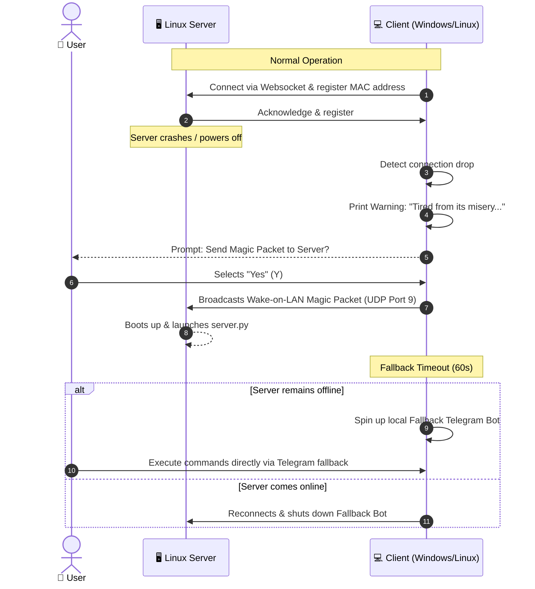

# 🌪️ windOS Assist

<p align="center">
  
  
  
  
  
</p>

---

**windOS Assist** is an advanced, cross-platform remote management and smart orchestration assistant. It connects a lightweight Linux-only server running a Telegram bot with client machines (running Windows or Linux) through secure, client-initiated WebSocket tunnels. It features a fully integrated agentic AI assistant capable of tool execution (function calling), Wake-on-LAN recovery, network-based geolocation tracking, weather checks, and a self-healing fallback bot failover.

---

## 🗺️ How It Works (Architecture)

Below is the dynamic visual diagram demonstrating how commands are routed, and how the system acts when the server is online vs. offline.

```mermaid
graph TD
    %% Styling
    classDef main fill:#2a7ae2,stroke:#fff,stroke-width:2px,color:#fff;
    classDef server fill:#f39c12,stroke:#fff,stroke-width:2px,color:#fff;
    classDef client fill:#27ae60,stroke:#fff,stroke-width:2px,color:#fff;
    classDef user fill:#8e44ad,stroke:#fff,stroke-width:2px,color:#fff;
    
    User([👤 User on Telegram]):::user <-->|Commands & Responses| TG[💬 Telegram Bot API]:::main
    TG <-->|Async Polling / Webhook| Serv[🖥️ windOS Server <br> Linux Daemon]:::server
    Serv <-->|Encrypted WebSocket <br> Token Auth| Cli[💻 windOS Client <br> Windows / Linux]:::client
    
    Cli -.->|Pipes stdin/stdout| Shell[🐚 Persistent Shell <br> cmd.exe / bash]:::client
    Cli -.->|Extracts Stats| HW[🔌 Volt / CPU / GPU / Screens]:::client
    
    subgraph Failover State (Server Offline)
        CliFail[💻 Local Client Fallback Bot]:::client <-->|Polls Directly| TG
    end
    
    CliFail -.->|Auto-spins up if| ServOff[❌ Server Connection Lost]:::server
```

---

## ⚡ Wake-on-LAN & Failover Cycle

The client monitors connection health. If the server crashes or powers off, the client triggers a recovery warning and can wake the server back up, or act as a temporary host.



---

## 🚀 Key Features

* **Zero Client Port Forwarding**: The client connects outward to the server. This bypasses double NATs and routers with no configuration required on the client network.
* **Agentic AI Tool Execution (Function Calling)**: Supports OpenAI-compatible APIs (Google Gemini, OpenAI, Ollama, OpenRouter). The AI has memory and is given live system resources. It can call:
  - `run_command(cmd)`: Run terminal commands.
  - `take_screenshot()`: Take screen captures.
  - `get_system_stats()`: Check resource usages and temperatures.
  - `wake_client()`: Boot up client via Wake-on-LAN.
  - `shutdown_client()`: Turn off client.
* **Neofetch Cloud ASCII Greeting**: Returns an ASCII cloud logo alongside stats on CPU model, GPU model, active clients, weather conditions, date, and 24h formatted time.
* **GPS-Jamming Proof Geolocation**: Uses external IP address analysis (`ip-api.com`) to locate devices and calculate distances, bypassing GPS blockers in regions like Ukraine.
* **Windows Task Scheduler Service**: Automatically registers as a silent Windows background task using a VBScript launcher (no command prompt window pops up).

---

## 🤖 Telegram Bot Commands

| Command | Action |
| --- | --- |
| `/start` / `/help` / `/greet` | Show Neofetch system overview cards, date/time, and coordinates weather. |
| `/clients` | List all registered client machines and select the active target. |
| `/wakeup` | Send a Wake-on-LAN Magic Packet to the active offline client (uses its registered MAC address). |
| `/screenshot` | Captures a high-resolution screenshot on the active client and uploads it. |
| `/terminal` or `/sh` | Enters an interactive terminal loop. Subsequent text messages run in a persistent shell. |
| `/ai <prompt>` | Command the AI assistant to perform tasks (e.g. `"/ai Check my disk usage and clean temporary files"`). |
| `/ai_chat` | Toggles continuous chat mode with the AI assistant (no prefix required). |
| `/power <shutdown\|reboot\|sleep>` | Issue power state transitions to the active client machine. |
| `/files <path>` | Browse the directory file structure on the client. |

---

## 🛠️ Setup & Installation

Run the client-sided installer directly on this machine:

1. Open **PowerShell** (Windows) or **Terminal** (Linux).
2. Navigate to the project directory:
   ```bash
   cd C:\Users\winmastt\.gemini\antigravity\scratch\windos-assist
   ```
3. Run the wizard:
   ```bash
   python setup.py
   ```
4. Choose **Option 1 (Full Setup)** to connect to your Linux server over SSH. The script will automatically:
   * Upload and deploy `server.py` on Linux as a `systemd` service.
   * Fetch the server's MAC address for client-side Wake-on-LAN recovery.
   * Write config files (`client_config.json`, `server_config.json`).
   * Setup a silent Windows Task Scheduler task running via `run_client.vbs` in the background.

---

## 📁 Repository Structure

```
windos-assist/
├── server/
│   ├── server.py             # Server daemon (Telegram, WebSocket, AI Agent, CLI)
│   └── server_config.json    # Server configuration (git-ignored)
├── client/
│   ├── client.py             # Client daemon (WebSocket, shell subprocess, Fallback Bot)
│   └── client_config.json    # Client configuration (git-ignored)
├── setup.py                  # CLI Installer & Configuration wizard
└── README.md                 # System manual & architecture visuals
```

---

> [!TIP]
> Open this project in your favorite editor and set `windos-assist` as your active workspace for quick edits!
